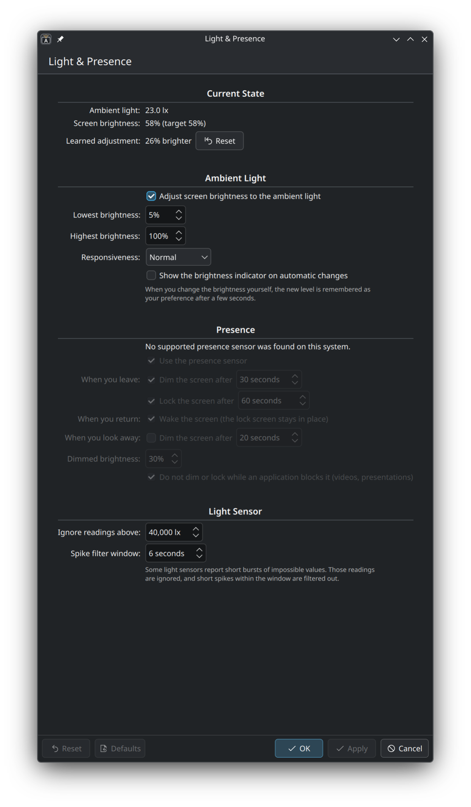
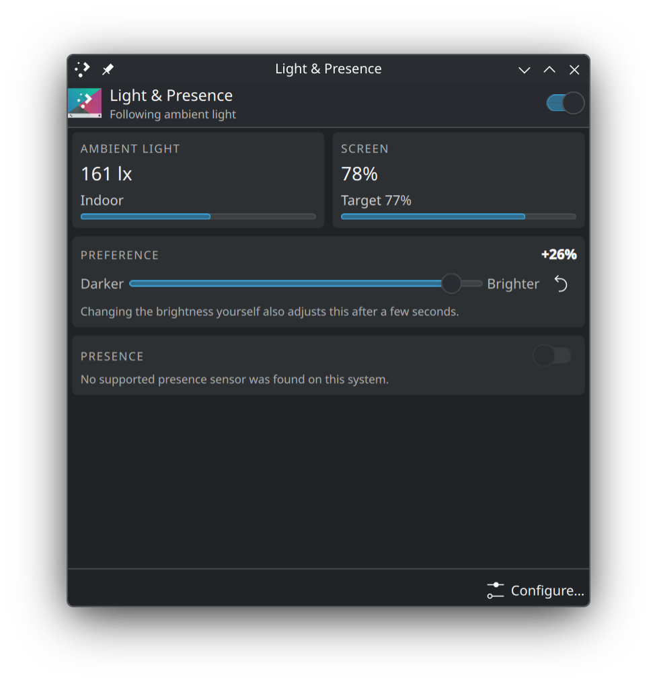

<p align="center">
  
</p>

<h1 align="center">plasma-light-and-presence</h1>

<p align="center">
  Ambient light brightness and presence awareness for KDE Plasma 6.
</p>

<p align="center">
  <a href="LICENSE"></a>
  <a href="https://kde.org/plasma-desktop/"></a>
  <a href="https://fedoraproject.org"></a>
  <a href="https://github.com/onuralpszr/plasma-light-and-presence/actions/workflows/check.yml"></a>
  <a href="https://copr.fedorainfracloud.org/coprs/thunderbirdtr/plasma-light-and-presence/package/plasma-light-and-presence/"></a>
</p>

plasma-light-and-presence adjusts the screen brightness of a KDE Plasma 6 session from the ambient light sensor. When the computer has a usable human presence sensor, it can also dim the screen when you leave, lock the session when you stay away, and wake the screen to the lock screen when you return.

The project has three parts:

- **plasma-light-and-presence**, a small service that runs in your user session.
- **Light & Presence**, a page in System Settings (under Display and Monitor).
- **Light & Presence**, a Plasma widget for the panel or the system tray, with the current readings, on and off switches and a brightness preference slider.

## Status

✅ working, ⚠️ partly working, ❌ not working, ⛔ blocked by hardware support

| Feature                                    | Status | Notes                                                                                                                                   |
| ------------------------------------------ | ------ | --------------------------------------------------------------------------------------------------------------------------------------- |
| Automatic brightness from the light sensor | ✅     | spike filter, smoothing and a learned preference                                                                                        |
| System Settings page                       | ✅     | Light & Presence, under Display and Monitor                                                                                             |
| Plasma widget                              | ✅     | panel or system tray                                                                                                                    |
| Presence: dim, lock and wake               | ⚠️     | ready, turns on only with a usable sensor                                                                                               |
| Presence on camera based sensors           | ⛔     | some laptops route presence detection through the camera; those sensors report nothing unless the camera streams, so presence stays off |

## Screenshots

| System Settings page                                                                              | Plasma widget                                                                       |
| ------------------------------------------------------------------------------------------------- | ----------------------------------------------------------------------------------- |
|  |  |

## Installing

On Fedora, plasma-light-and-presence is available from COPR:

```bash
sudo dnf copr enable thunderbirdtr/plasma-light-and-presence
sudo dnf install plasma-light-and-presence
systemctl --user enable --now plasma-light-and-presence
kbuildsycoca6
systemctl --user restart plasma-plasmashell
```

`kbuildsycoca6` refreshes the System Settings and search index, and restarting the Plasma shell loads the new widget without logging out. Then open System Settings, Display and Monitor, Light & Presence, or add the Light & Presence widget to a panel.

## Requirements

- KDE Plasma 6 (the service uses PowerDevil's `org.kde.ScreenBrightness` interface to change the brightness).
- iio-sensor-proxy, which gives access to the ambient light sensor.
- Python 3 with the `dbus` and `gi` modules (`python3-dbus` and `python3-gobject` on Fedora).

## Building

Build dependencies on Fedora:

    sudo dnf install cmake gcc-c++ extra-cmake-modules kf6-rpm-macros \
        qt6-qtbase-devel qt6-qtdeclarative-devel \
        kf6-kconfig-devel kf6-kcoreaddons-devel kf6-ki18n-devel kf6-kcmutils-devel

Then:

    cmake -B build -DCMAKE_INSTALL_PREFIX=/usr
    cmake --build build
    sudo cmake --install build

An RPM spec file is provided in `packaging/plasma-light-and-presence.spec`.

## Starting the service

The package does not enable the service for every user. To start it now and at every login, run:

    systemctl --user enable --now plasma-light-and-presence

The widget and the settings page also offer a button to start it for the current session. To see what the service does, read its log:

    journalctl --user -u plasma-light-and-presence -f

For troubleshooting, the service can run in the foreground with `--debug`, and with `--dry-run` it reads the sensors without changing the brightness.

## How automatic brightness works

- The light sensor is read every half second. iio-sensor-proxy only signals when the value changes, so the service polls it instead of waiting.
- Some sensors report short bursts of impossible values. Readings above 40000 lux are dropped, and the light level is the 30th percentile of the last six seconds, so a short burst cannot move it.
- Every two seconds the level is smoothed (weight 0.3 at the Normal responsiveness) and mapped to a brightness on a logarithmic curve:

  | Light (lux) | Brightness |
  | ----------: | ---------: |
  |           0 |         8% |
  |          10 |        25% |
  |         100 |        45% |
  |        1000 |        75% |
  |       10000 |       100% |

- The brightness changes only when the target differs by more than a few percent, and then with a short fade.
- When you change the brightness yourself and leave it for ten seconds, the difference is kept as your preference and applied on top of the curve from then on. The widget's slider sets the same preference.
- When the brightness drops to half or less at once (Plasma dimming an idle screen), adjustment pauses until the brightness comes back. Nothing is learned from it.

The learned preference is kept in `~/.local/state/plasma-light-and-presence/state`. A preference saved by the earlier auto brightness prototype is imported on first start.

## Presence

Presence is optional and only becomes active when a sensor proves usable. The service looks for the kernel's HID human presence sensor (an IIO device named `prox`) and for a proximity sensor exposed by iio-sensor-proxy. A sensor is only trusted after it has reported changing values. Some presence sensors are camera based and report "not available" unless the camera is streaming; on such systems the presence options stay greyed out and the settings page shows "No supported presence sensor was found on this system."

When a sensor is usable, the following actions can be enabled:

- dim the screen when you have been away for a while;
- lock the session (`loginctl lock-session`) when you stay away longer;
- wake the screen when you return. The lock screen stays in place; the service never unlocks the session;
- dim the screen when you look away from it, on sensors that report attention;
- skip dimming and locking while an application blocks power management, for example during a video or a presentation.

The `tools/` directory contains diagnostic scripts for HID presence sensors. They must run as root.

## Settings

Settings are stored in `~/.config/plasma-light-and-presencerc`. System-wide defaults can be placed in `/etc/xdg/plasma-light-and-presencerc`. The service notices changes to the file and applies them at once. Example:

    [AutoBrightness]
    Enabled=true
    MinPercent=5
    MaxPercent=100
    Responsiveness=Normal
    ShowOsd=false
    Curve=0:8 10:25 100:45 1000:75 10000:100

    [Presence]
    Enabled=true
    DimWhenAway=true
    DimAwaySeconds=30
    LockWhenAway=true
    LockAwaySeconds=60
    WakeOnReturn=true

    [Sensors]
    MaxLux=40000
    SpikeWindowSeconds=6

The full list of keys is in `kcm/lightandpresencesettings.kcfg`.

## D-Bus interface

The service owns `io.github.onuralpszr.LightAndPresence` on the session bus, with the object `/io/github/onuralpszr/LightAndPresence`.

Properties (announced with `PropertiesChanged`): `Lux`, `Brightness`, `Target`, `Offset` (percent), `Paused`, `AutoBrightnessEnabled`, `ShowOsd`, `LightSensorAvailable`, `DisplayAvailable`, `PresenceEnabled`, `PresenceAvailable`, `Present`, `Attentive`, `Distance` (metres, -1 when unknown), `PresenceState` and `Version`.

Methods: `SetAutoBrightnessEnabled(b)`, `SetPresenceEnabled(b)`, `SetOffset(d)`, `ResetOffset()`, `Reload()`, and the argument-free `EnableAutoBrightness()`, `DisableAutoBrightness()`, `EnablePresence()` and `DisablePresence()`.

For example:

    busctl --user get-property io.github.onuralpszr.LightAndPresence /io/github/onuralpszr/LightAndPresence \
        io.github.onuralpszr.LightAndPresence Lux

## Credits

plasma-light-and-presence is built on these projects. Thank you to everyone behind them.

- [KDE Frameworks](https://develop.kde.org/products/frameworks/): [KConfig](https://invent.kde.org/frameworks/kconfig), [KCMUtils](https://invent.kde.org/frameworks/kcmutils), [Kirigami](https://invent.kde.org/frameworks/kirigami) and [KI18n](https://invent.kde.org/frameworks/ki18n).
- [KDE Plasma](https://kde.org/plasma-desktop/): [libplasma](https://invent.kde.org/plasma/libplasma) for the widget and [PowerDevil](https://invent.kde.org/plasma/powerdevil) for the screen brightness interface.
- [iio-sensor-proxy](https://gitlab.freedesktop.org/hadess/iio-sensor-proxy), for the ambient light and proximity sensors.
- The Linux [HID sensor hub and IIO](https://docs.kernel.org/hid/hid-sensor.html) drivers, which expose the human presence sensor.
- [dbus-python](https://gitlab.freedesktop.org/dbus/dbus-python) and [systemd-logind](https://www.freedesktop.org/software/systemd/man/latest/systemd-logind.service.html), for the session bus and screen locking.
- [xps-fedora](https://github.com/onuralpszr/xps-fedora), where this started as an auto brightness prototype.

## License

plasma-light-and-presence is distributed under the Apache License, Version 2.0. See the `LICENSE` file.
